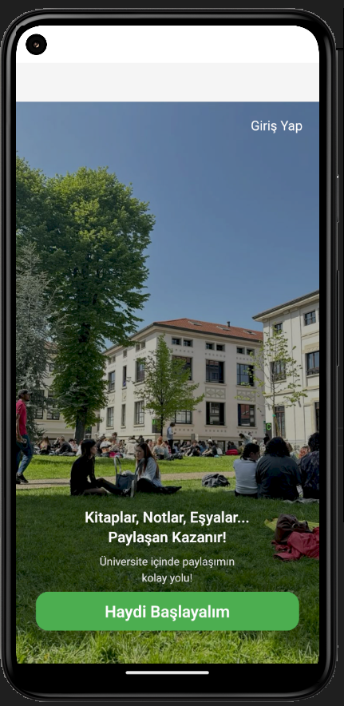
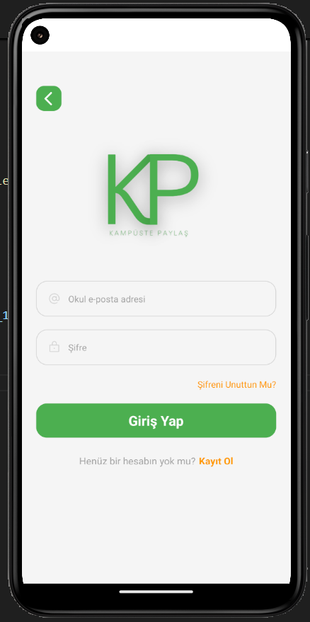
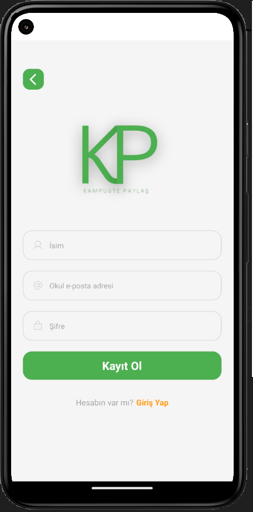
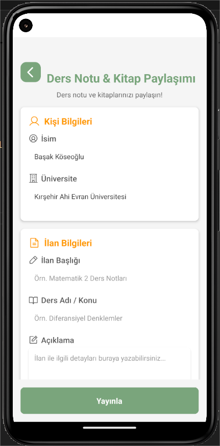
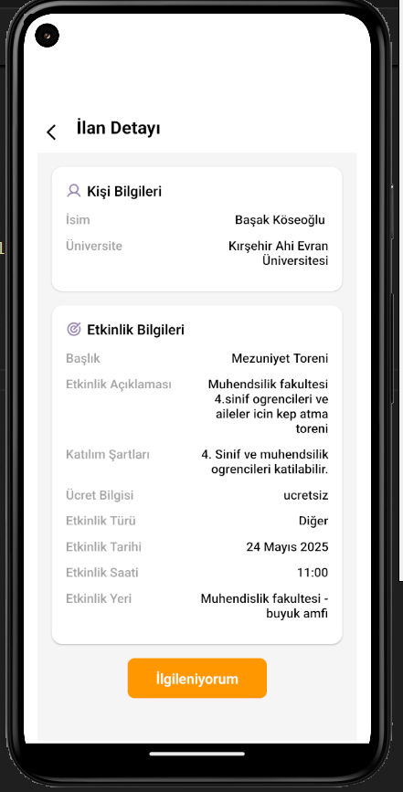
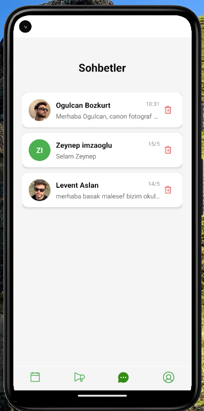
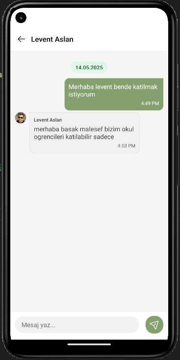
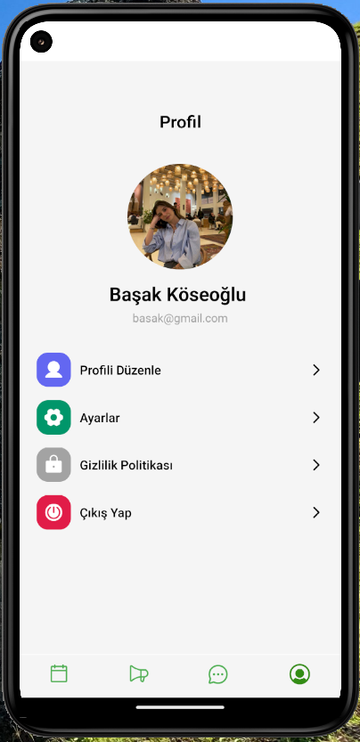

<h1 align="center">📱 Kampüste Paylaş</h1>

  <b>Kampüste Paylaş</b>, üniversite öğrencileri için özel olarak geliştirilmiş bir mobil uygulamadır. 
  Amacı, öğrencilerin kampüs hayatını daha <b>sosyal</b>, <b>verimli</b> ve <b>keyifli</b> hale getirmektir.

Bu uygulama sayesinde öğrenciler:

- 📢 <b>Duyuru ve İlanlar</b> paylaşabilir  
- 📅 <b>Etkinliklere</b> katılabilir  
- 📚 <b>Not ve kaynak alışverişi</b> yapabilir  
- 🤝 <b>Gönüllülük fırsatları</b> bulabilir  
- 💬 <b>Gerçek zamanlı mesajlaşma</b> ile iletişim kurabilir  

Kısacası <b>Kampüste Paylaş</b>, kampüs hayatını dijital bir topluluk ortamına taşıyan modern bir platformdur.

---

<h2>🚀 Özellikler</h2>

- 👥 Öğrenciler arası <b>ilan ve paylaşım sistemi</b>  
- 💬 <b>Gerçek zamanlı chat</b> (Firestore tabanlı)  
- 📸 <b>Cloudinary API</b> ile medya yükleme  
- 🔑 <b>Firebase Authentication</b> ile güvenli giriş  
- 📱 <b>React Native + Expo</b> ile modern, hızlı ve şık arayüz  

---

<h2>🛠 Kullanılan Teknolojiler</h2>

- React Native (Expo)  
- Firebase Firestore  
- Firebase Authentication  
- Cloudinary API  
---

<h2>📸 Ekran Görüntüleri</h2>

  
  
  

  
  
  

  
  
  

  

